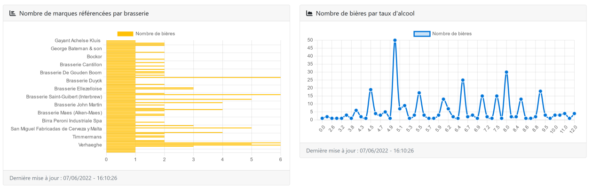
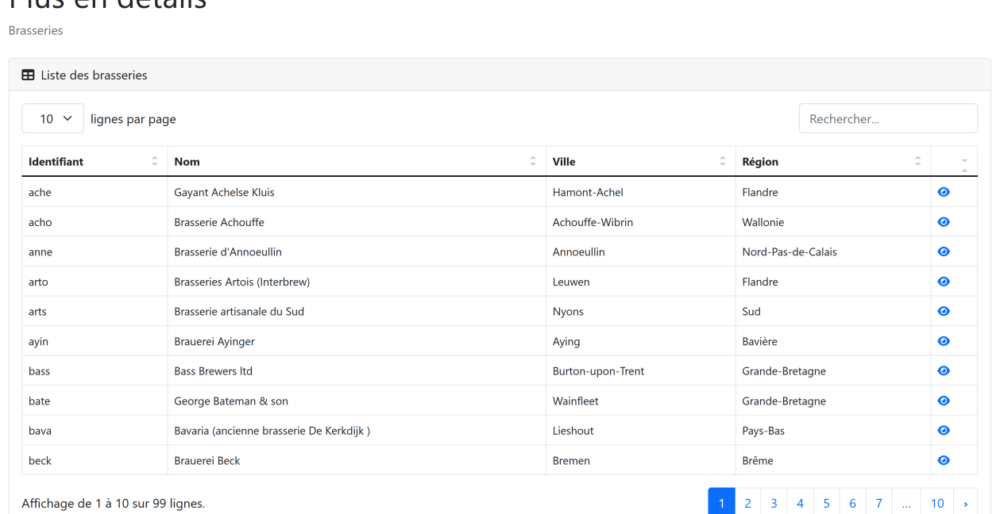

# Projet : BEERBOARD

## Contexte de l'application

La société Shoptout a demandé aux Analystes Développeurs de la Chambre des Commerces 
et de l’Industrie de l’Indre de créer une application web pour recenser les bières 
présentes dans leur stock afin de pouvoir conseiller les clients.    
Ce beerboard permettra aussi d’afficher quelques statistiques sur les bières présentes 
dans la base de données.

## Environnement technique

### Application web
L’application web Beerboard est écrite en JAVA 11. Elle utilise le framework Spring Boot 2.6.2.

### Informations de connexion
### Lien : [Lien d'accès à la démo](http://94.247.183.122:8080/)
#### Login : zankidine.abdou
#### Mdp : zankidineabdou

### Base de données
La base de données utilisée est locale et utilise le moteur MySQL. Un dump de la base de données
est disponible dans le répertoire src\main\resources\sql.

#### Schéma de la base de données

## Les fonctionnalités
### Accueil - Statistiques

 

### Profil

### Liste des brasseries
L’URL pour afficher la liste des brasseries est /breweries.

### Détail d'une brasserie
L’URL pour afficher le détail est /see-brewery/{code} où {code} correspond au code 
la brasserie sélectionnée.

### Formulaire d'ajout/modification d'une brasserie

### Liste des bières
L’URL pour afficher la liste des bières est /beers. Le modèle de tableau utilisé 
est le même que pour les brasseries (cf. 4.1.1).

### Détail d'une bièr
L’URL pour afficher le détail est /see-beer/{marque}/{version} où {marque} correspond à la marque de la bière sélectionnée et 
{version} à la version de la bière sélectionnée.e

### Formulaire d'ajout/modification d'une bière
L’URL pour ajouter une bière est /add-beer.

### Login

